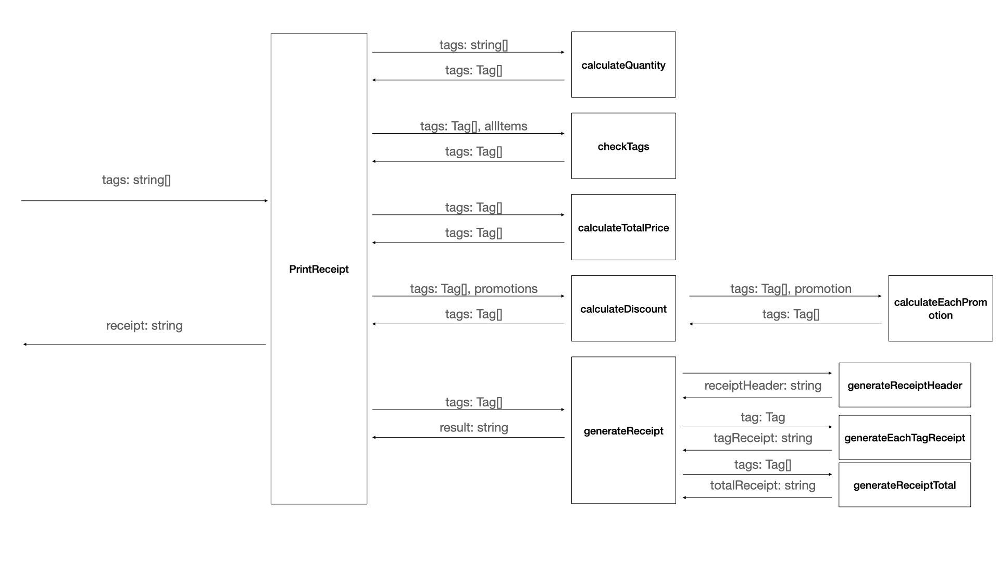

# Task

1. process all input tags item and recalculate quantity
    * Input: tags: string[]
    * Output: tags: Tag[] ({barcode: string, quantity: number})
2. Check the Tag barcode is valid in Items
    * Input: tags: Tag[], allItems
    * Output: tags: Tag[] ({barcode: string, quantity: number, itemInfo: Item})
3. Calculate each tag total price
    * Input: tags: Tag[]
    * Output: tags: Tag[] ({barcode: string, quantity: number, itemInfo: Item, totalPrice: number})
4. Calculate each tag discount by promotions
    1. calculate promotion BUY_TWO_GET_ONE_FREE
    * Input: tags: Tag[], promotions
    * Output: tags: Tag[] ({barcode: string, quantity: number, itemInfo: Item, totalPrice: number, discount: number})
5. Print tags Receipt string
    1. print receipt header
    2. print each tag part
    3. print total and discount part
    * Input: tags: Tag[]
    * Output: string

---
# Context Map
