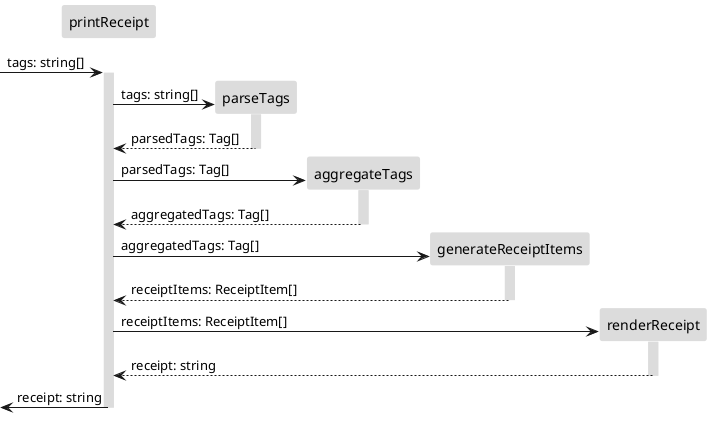

# Tasking
1. Parse tags from the input
    - Input: tags: string[]
    - Output: parsedTags: Tag[]
1. Aggregate parsed tags as there might be a few duplicated items
    - Input: parsedTags: Tag[]
    - Output: aggregatedTags: Tag[]
1. Generate receipt items based on the aggregated tags.
    - Input: aggregatedTags: Tag[]
    - Output: receiptItems: ReceiptItem[]
1. Renders receipt items as a string in the specified format
    - Input: receiptItems: ReceiptItem[]
    - Output: receipt: string

# Context Map

