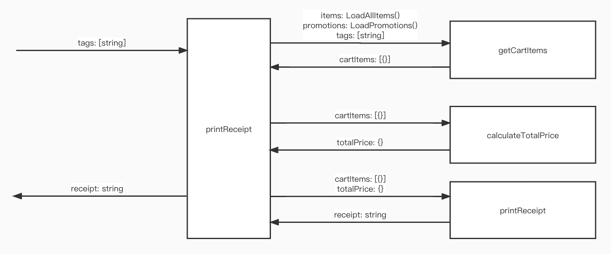

# Tasking

1. Get the items in shopping cart
- Input:
```
    Items [{
        barcode: string,
        name: string,
        unit: string,
        price: number
    }]: LoadAllItems()

    Promotions [{
        type: string,
        barcodes: [string]
    }]: LoadPromotions()
    
    Tags: [String]
```
- Output:
```
    CartItems [{
        barcode: string,
        name: string,
        unit: string,
        price: number,
        quantity: number,
        subtotal: number,
        discount: number
    }]
```

2. Calculate total price and discount
- Input:
```
    CartItems [{
        barcode: string,
        name: string,
        unit: string,
        price: number,
        quantity: number,
        subtotal: number,
        discount: number
    }]
```
- Output:
```
    TotalPrice {
        totalPrice: number,
        discountedPrice: number
    }
```

3. Print the receipt
- Input:
```
    CartItems [{
        barcode: string,
        name: string,
        unit: string,
        price: number,
        quantity: number,
        subtotal: number,
        discount: number
    }]
    
    TotalPrice {
        totalPrice: number,
        discountedPrice: number
    }
```
- Output:
```
    receipt: string
```

# Context Map

